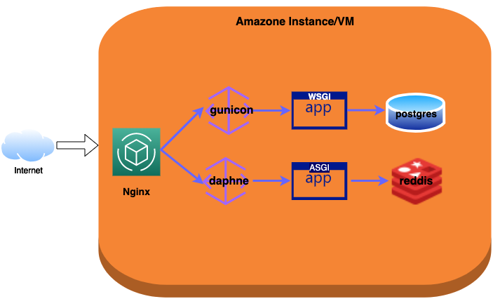

## Description
I am interesting in movie analysis. To let my friends in our school have a platform to
discuss on movices. I created this appliacation and have it running on Amazon.

Web url: https://moviechat-club.chat

Moviechat is a online chat application. It is a Django application written in Python.

## Architecture

## Reference

- https://github.com/mitchtabian/HOWTO-django-channels-daphne#Publish-your-Project-to-Github
- https://www.djangoproject.com/start/overview/
- https://https://nginx.org/en/
- https://pypi.org/project/daphne/
- https://www.postgresql.org/docs/
https://redis.com/

